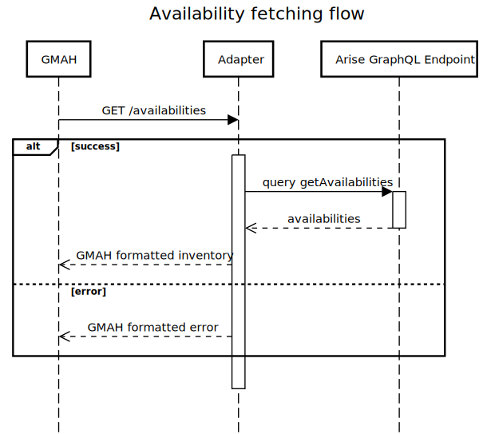
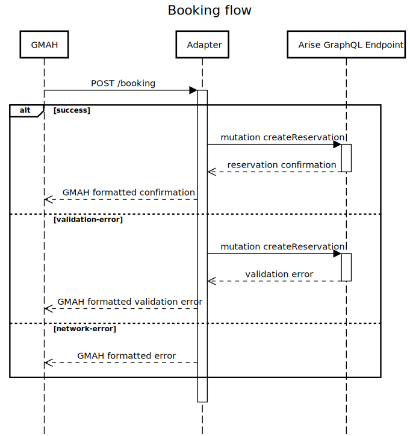

# Arise Backend Technical Test

For the Backend Developer position at Arise, we are looking for a talented
and fast-learning individual to join our team.
This technical test is designed to assess your technical skills and ability to
work with :

- Node.js and TypeScript
- GraphQL endpoints
- Third-party APIs

You may use all the time you need to complete this test, but you will be expected
to complete it within 4 hours or so.
Complete as much as you can during that time window. You will be judged against
the quality of your implementation and your ability to communicate your ideas clearly and concisely.

> If you need any clarifications on the test, please contact Loïc Payol at <loic@arise.travel>

---

## Third-party integration : GiveMeAnHotel.com

Let's consider the hypothetical hotel search engine GiveMeAHotel.com.
GMAH allows end users to search hotels by location, price, and other criteria.
GMAH has now a deal with Arise to build a backend service that would allow them
to search for hotels in real-time. To do so, they would need to integrate their
already existing API to our network. You'll be tasked to make that integration.

### Availability fetching

Whenever a request is made on GMAH's website by a client, GMAH will fetch the
availability of the rooms we have for the hotels matching the client's query.

### Booking

GMAH allows clients to book rooms for their stay directly on the same website.
This allows an higher conversion rate and enhances the overall user experience.

## The Arise GraphQL Endpoint

In order to interact with the Arise network, we created a GraphQL endpoint that
queries and mutates the network states in a convenient interface. For this test,
we created a light version of that schema, with an on-memory database. Mutations
won't be effectful but will behave as if they have successfully saved the data.

The GraphQL endpoint you're going to use is hosted at
<https://backend-tech-test.staging.arise.travel>. You can use the built-in
[Altair IDE](https://backend-tech-test.staging.arise.travel/altair) to quickly
interact with it.

The GraphQL schema is self documented. We recommend using
[GraphQL Voyager](https://apis.guru/graphql-voyager/) in order to generate a
visual representation of the schema you're going to use.

---

## Tasks

You are asked to **implement the GMAH API**, following the OpenAPI specifications in
`openapi.yaml`. You may use editor.swagger.io to generate a visual API documentation.

You are required to **setup a Node.js server** that will serve your implementation
of the API. You are free to use any framework/module in the Node.js ecosystem.
Your final submission will be judged with the level of expectation of any code
going to a _production environement_.

Extra points will be awarded for :

- Network failure management/retry strategies
- Proper validation of the input data
- Correct usage of TypeScript
- Some form of authentication (Basic/JWT/...)

**Include a `README.md`** explaining how to run your project and some explanation
on your design choices you might find useful.

### Submitting your code

Once you're done, publish your code on any open Git platform (GitHub, Gitlab, ...)
and send us the link to your repository.
Self-criticism on your submission is encouraged, but not required.

**Good luck!**
